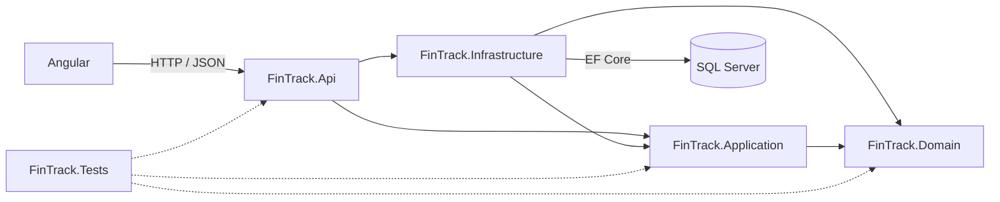

# FinTrack

Aplicação fullstack de gestão financeira pessoal construída como projeto de portfólio. O FinTrack permite organizar receitas e despesas por categoria, filtrar movimentações e acompanhar o saldo de cada período em um dashboard protegido por autenticação JWT.

## Funcionalidades

- cadastro e login com senha armazenada por hash e sessão JWT;
- categorias de receita e despesa isoladas por usuário;
- criação, edição, exclusão, filtros e paginação de movimentações;
- resumo do período com receitas, despesas, saldo e totais por categoria;
- validações no domínio, na aplicação e na entrada HTTP;
- respostas de erro no padrão Problem Details e limitação de tentativas nos endpoints de autenticação;
- interface Angular responsiva com guard de rotas e interceptor de autenticação;
- testes unitários e de integração contra SQL Server real e isolado;
- containers para frontend, API e banco, além de CI no GitHub Actions.

## Arquitetura



| Projeto | Responsabilidade |
| --- | --- |
| `FinTrack.Domain` | Entidades, enums e invariantes do domínio financeiro. |
| `FinTrack.Application` | Casos de uso, contratos, DTOs, filtros e interfaces. |
| `FinTrack.Infrastructure` | EF Core, repositórios, migrations, hash de senha e emissão JWT. |
| `FinTrack.Api` | Controllers REST, autenticação, DI, rate limiting e tratamento de exceções. |
| `FinTrack.Tests` | Testes unitários e testes de integração da API. |
| `fintrack-web` | SPA Angular, formulários, navegação protegida e consumo da API. |

O domínio não depende das demais camadas. Application depende apenas do domínio; Infrastructure implementa seus contratos; Api compõe e expõe a aplicação.

## Tecnologias

- .NET 10, ASP.NET Core e C#;
- Entity Framework Core 10 e SQL Server;
- Angular 22, TypeScript 6 e Vitest;
- xUnit e `WebApplicationFactory`;
- Docker, Docker Compose e GitHub Actions.

## Endpoints

Os endpoints, exceto cadastro, login e health check, exigem `Authorization: Bearer <token>`.

| Método | Rota | Uso |
| --- | --- | --- |
| `POST` | `/api/auth/register` | Cadastrar usuário e obter token. |
| `POST` | `/api/auth/login` | Autenticar e obter token. |
| `GET` | `/api/categories` | Listar categorias do usuário. |
| `POST` | `/api/categories` | Criar categoria. |
| `GET` | `/api/categories/{id}` | Consultar categoria. |
| `PUT` | `/api/categories/{id}` | Editar categoria. |
| `DELETE` | `/api/categories/{id}` | Excluir categoria sem movimentações. |
| `GET` | `/api/transactions` | Listar e filtrar movimentações. |
| `POST` | `/api/transactions` | Criar movimentação. |
| `GET` | `/api/transactions/{id}` | Consultar movimentação. |
| `PUT` | `/api/transactions/{id}` | Editar movimentação. |
| `DELETE` | `/api/transactions/{id}` | Excluir movimentação. |
| `GET` | `/api/dashboard` | Resumir receitas, despesas, saldo e categorias. |
| `GET` | `/health` | Verificar disponibilidade da API. |

`GET /api/transactions` e `GET /api/dashboard` aceitam `from`, `to`, `type` e `categoryId`. A listagem também aceita `page` e `pageSize`. `type=1` representa receita e `type=2`, despesa.

Durante o desenvolvimento, o documento OpenAPI fica disponível em `http://localhost:5095/openapi/v1.json`.

## Execução local

Pré-requisitos: .NET SDK 10, Node.js 24, npm e SQL Server acessível em `localhost` com autenticação integrada.

1. Defina a chave JWT apenas no ambiente local:

   ```powershell
   $env:Jwt__Key = '<uma-chave-local-com-pelo-menos-32-bytes>'
   $env:Jwt__Issuer = 'FinTrack.Api'
   $env:Jwt__Audience = 'FinTrack.Web'
   $env:Jwt__LifetimeMinutes = '60'
   ```

2. Aplique as migrations e inicie a API:

   ```powershell
   dotnet ef database update --project FinTrack.Infrastructure --startup-project FinTrack.Api
   dotnet run --project FinTrack.Api
   ```

3. Em outro terminal, inicie o Angular:

   ```powershell
   cd fintrack-web
   npm ci
   npm start
   ```

4. Acesse `http://localhost:4200`.

A connection string de desenvolvimento está em `FinTrack.Api/appsettings.Development.json` e usa autenticação integrada, sem credenciais versionadas.

## Execução com Docker

1. Copie `.env.example` para `.env`.
2. Preencha `FINTRACK_SA_PASSWORD` com uma senha compatível com a política do SQL Server e `FINTRACK_JWT_KEY` com uma chave aleatória de pelo menos 32 bytes.
3. Execute:

   ```powershell
   docker compose up --build
   ```

O frontend fica em `http://localhost:4200`, a API em `http://localhost:5095` e o SQL Server é exposto em `localhost:14330`. A API aguarda o banco e aplica as migrations na inicialização do container. Dados ficam no volume `sqlserver-data`. O arquivo `.env` está ignorado pelo Git.

Para encerrar os containers, use `docker compose down`. Acrescente `--volumes` somente quando quiser apagar os dados locais.

## Build e testes

```powershell
dotnet build
dotnet test
cd fintrack-web
npm ci
npm run build
npm test -- --watch=false
```

Os testes de integração criam um banco `FinTrack_Tests_<id>`, aplicam todas as migrations e removem a base ao terminar. Por padrão usam SQL Server local com autenticação integrada. Em CI, `FINTRACK_TEST_CONNECTION` fornece apenas a conexão efêmera criada durante o job.

## Estrutura

```text
Fintrack/
├── FinTrack.Domain/
├── FinTrack.Application/
├── FinTrack.Infrastructure/
│   └── Persistence/Migrations/
├── FinTrack.Api/
├── FinTrack.Tests/
│   └── Integration/
├── fintrack-web/
├── .github/workflows/ci.yml
└── docker-compose.yml
```
